# fault-mapper Architecture (C4 Model)

> Detailed C4 architecture diagrams for the fault-mapper platform.
> Version 0.9.0 | Dual-module: Fault + Procedural

---

## C4 Level 1 -- System Context

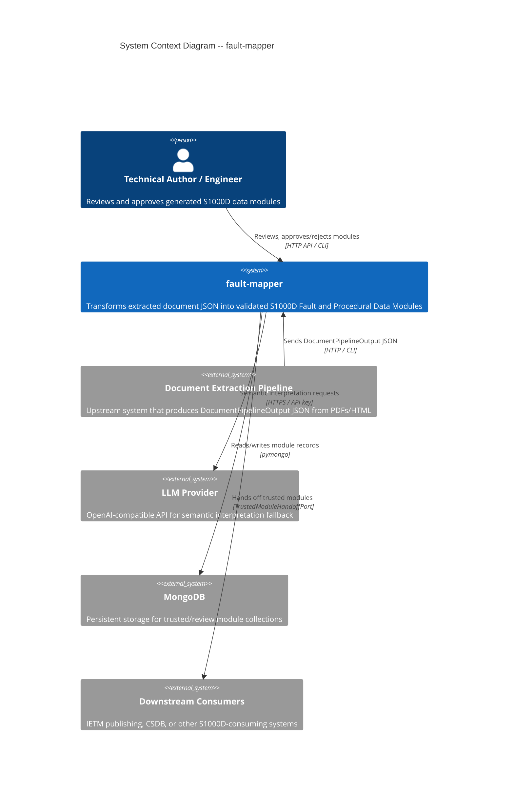

### Key Interactions

| From | To | Protocol | Data |
|---|---|---|---|
| Extraction Pipeline | fault-mapper | HTTP POST / CLI stdin | `DocumentPipelineOutput` JSON |
| fault-mapper | LLM Provider | HTTPS | Structured prompts, JSON responses |
| fault-mapper | MongoDB | pymongo TCP | Module CRUD, audit events |
| fault-mapper | Downstream | `TrustedModuleHandoffPort` | Approved `S1000DFaultDataModule` / `S1000DProceduralDataModule` |
| Engineer | fault-mapper | HTTP / CLI | Review actions (approve/reject/sweep) |

---

## C4 Level 2 -- Container Diagram

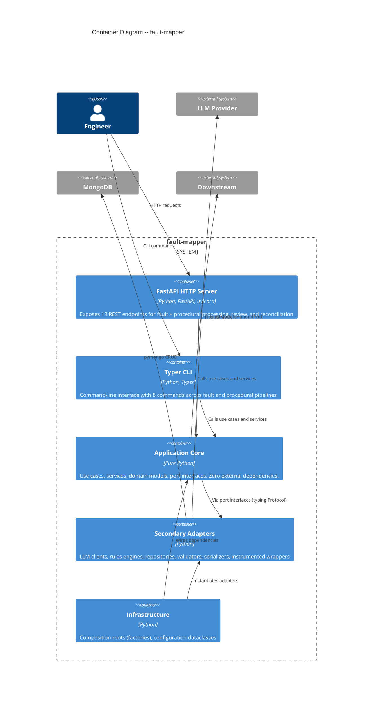

### Container Inventory

| Container | Technology | Files | Responsibility |
|---|---|---|---|
| **FastAPI HTTP** | FastAPI + Pydantic | 7 files | REST API (9 fault + 4 procedural endpoints) |
| **Typer CLI** | Typer | 2 files | CLI (6 fault + 2 procedural commands) |
| **Application Core** | Pure Python | 32 files | Use cases, services, domain models, ports |
| **Secondary Adapters** | Python | 21 files | LLM, rules, repos, validators, serializers, metrics |
| **Infrastructure** | Python | 4 files | Factories, config dataclasses |

---

## C4 Level 3 -- Component Diagram (Application Core)

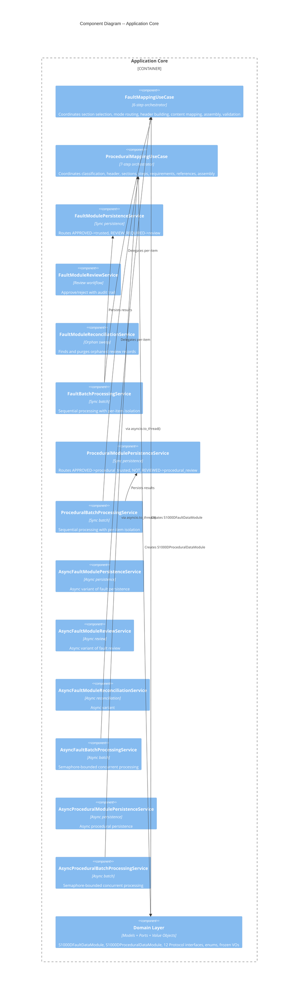

---

## C4 Level 3 -- Component Diagram (Secondary Adapters)

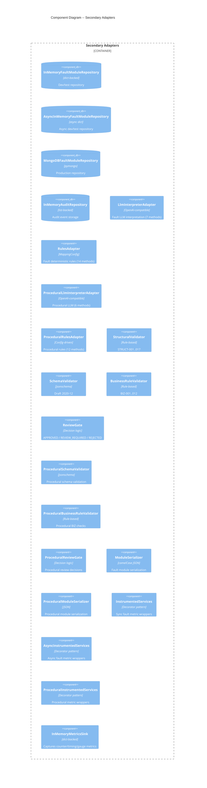

---

## C4 Level 3 -- Component Diagram (Fault Pipeline Detail)

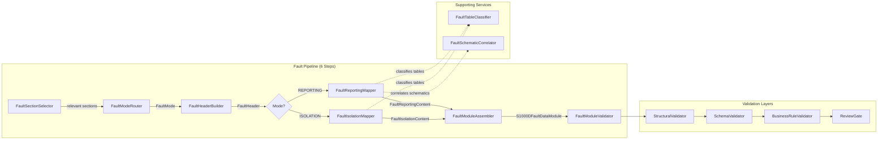

---

## C4 Level 3 -- Component Diagram (Procedural Pipeline Detail)

```mermaid
flowchart LR
    subgraph "Procedural Pipeline (7 Steps)"
        A[ProceduralDocumentClassifier] -->|relevant sections| B[ProceduralHeaderBuilder]
        B -->|ProceduralHeader| C[ProceduralSectionOrganizer]
        C -->|ordered sections| D[ProceduralStepExtractor]
        D -->|step tree| E[ProceduralRequirementExtractor]
        E -->|requirements| F[ProceduralReferenceExtractor]
        F -->|references| G[ProceduralModuleAssembler]
    end

    subgraph "Validation"
        V1[ProceduralSchemaValidator]
        V2[ProceduralBusinessRuleValidator]
        V3[ProceduralReviewGate]
    end

    G -->|S1000DProceduralDataModule| V1 --> V2 --> V3
```

---

## C4 Level 4 -- Code Diagram (Domain Model)

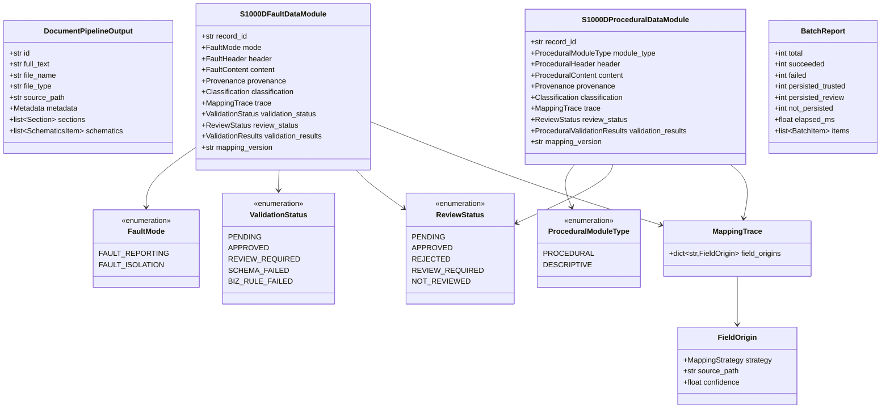

---

## C4 Level 4 -- Code Diagram (Port Interfaces)

```mermaid
classDiagram
    class LlmInterpreterPort {
        <<Protocol>>
        +assess_fault_relevance(section) RelevanceResult
        +determine_fault_mode(sections) FaultModeResult
        +extract_fault_descriptions(sections) list
        +extract_isolation_steps(sections) list
        +extract_lru_sru(sections) list
        +correlate_schematics(schematics, sections) list
        +classify_table(table) TableClassification
    }

    class RulesEnginePort {
        <<Protocol>>
        +check_fault_keywords(section) KeywordResult
        +determine_fault_mode_by_rules(sections) FaultModeResult
        +build_dm_code(input, mode) DmCode
        +14 methods total
    }

    class ProceduralLlmInterpreterPort {
        <<Protocol>>
        +assess_procedural_relevance(section) RelevanceResult
        +classify_section_type(section) SectionTypeResult
        +extract_steps(section) list~ProceduralStep~
        +extract_requirements(section) PreliminaryRequirements
        +extract_references(section) list~Reference~
        +determine_module_type(sections) ModuleTypeResult
    }

    class ProceduralRulesEnginePort {
        <<Protocol>>
        +check_procedural_keywords(section) KeywordResult
        +classify_section_by_rules(section) SectionTypeResult
        +build_procedural_dm_code(input, type) DmCode
        +12 methods total
    }

    class FaultModuleRepositoryPort {
        <<Protocol>>
        +save_trusted(module) str
        +save_review(module) str
        +find_by_id(id) Module?
        +find_review_items(limit, offset) list
        +delete_review(id) bool
        +count_review() int
    }

    class MetricsSinkPort {
        <<Protocol>>
        +increment(name, value, tags)
        +timing(name, ms, tags)
        +gauge(name, value, tags)
    }

    class AuditRepositoryPort {
        <<Protocol>>
        +record_event(event) None
        +find_events(filter) list
    }
```

---

## Deployment View

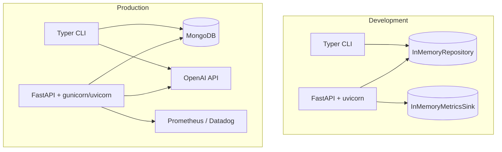

---

## Data Flow -- Fault Module Processing

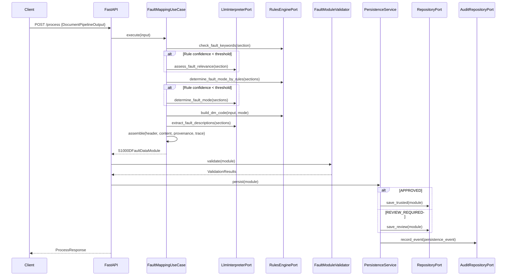

---

## Data Flow -- Procedural Module Processing

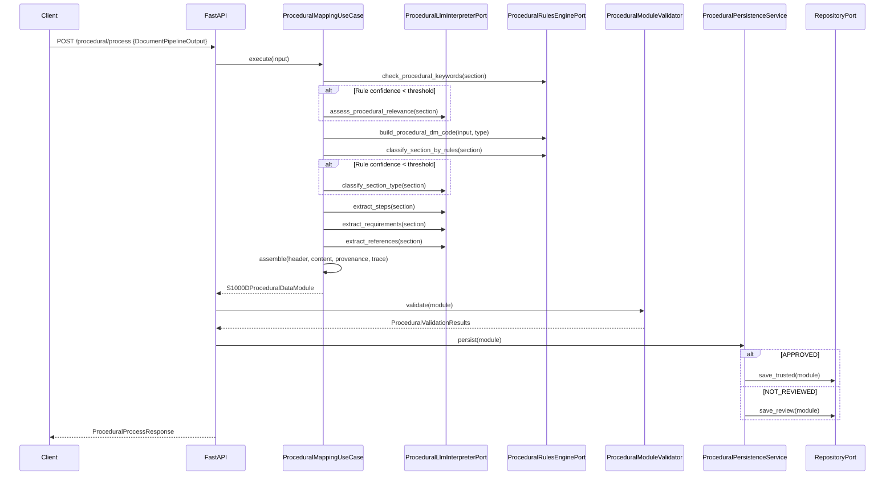

---

## Data Flow -- Batch Processing

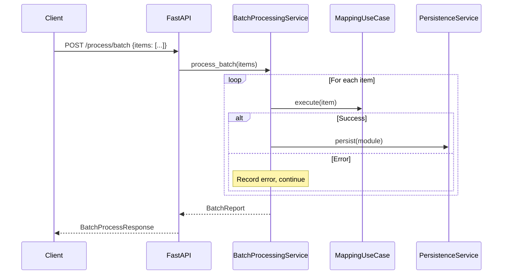

### Async Batch (Bounded Concurrency)

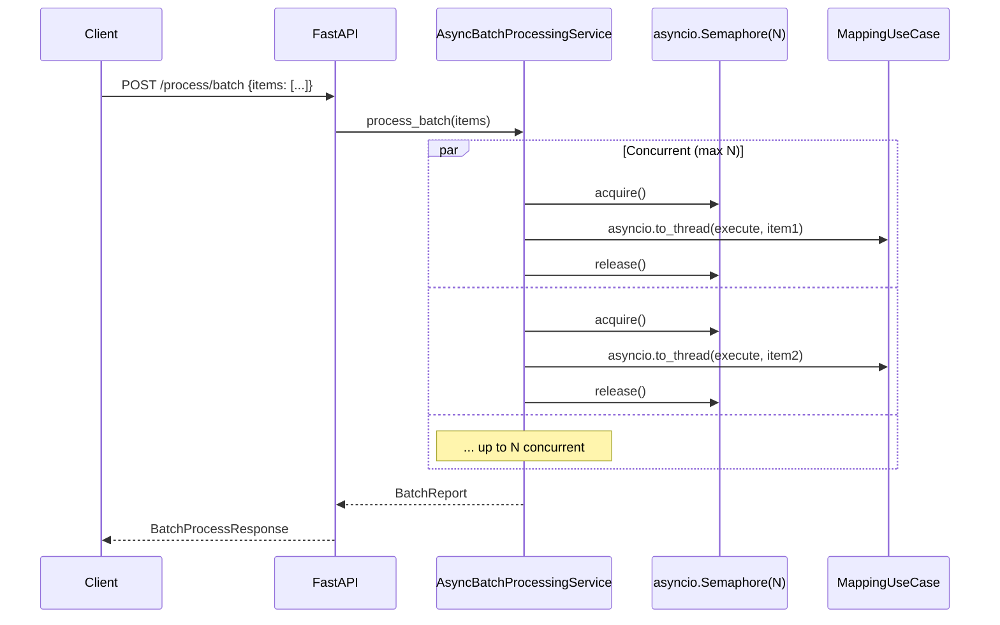

---

## Cross-Cutting Concerns

### Observability Architecture

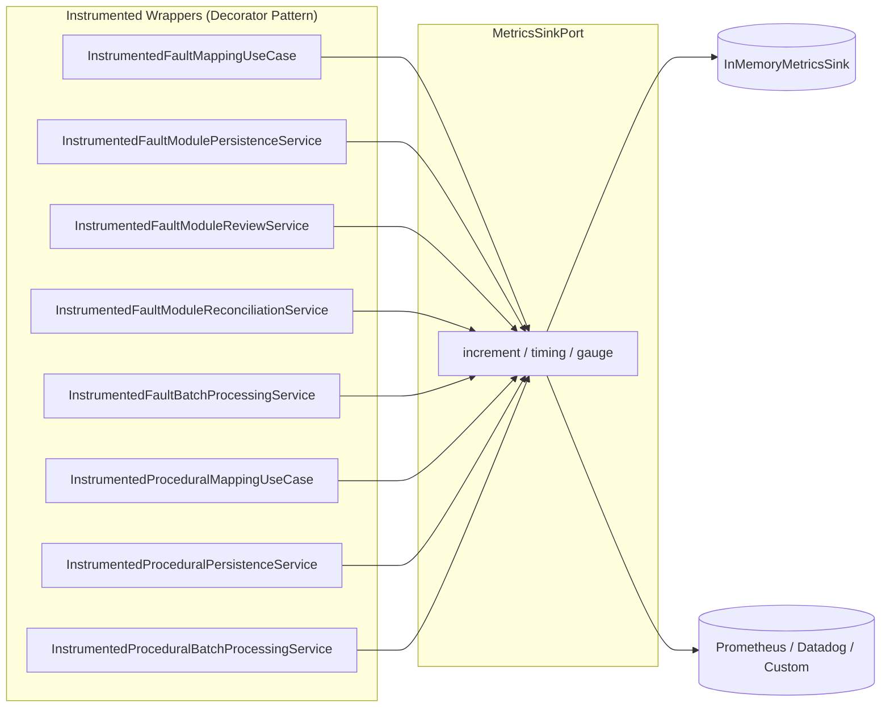

### Dependency Injection (Composition Roots)

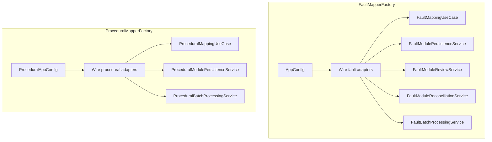

---

## Architecture Decision Records

### ADR-1: Hexagonal Architecture

**Decision:** Use hexagonal (ports-and-adapters) architecture.

**Rationale:** The system must support multiple deployment modes (HTTP API, CLI), multiple persistence backends (in-memory, MongoDB), and multiple LLM providers. Hexagonal architecture enables this flexibility while keeping the domain logic pure and testable.

### ADR-2: Two-Pass Strategy (RULE then LLM)

**Decision:** Always attempt deterministic rule-based interpretation before falling back to LLM.

**Rationale:** LLM calls are expensive (latency + cost) and non-deterministic. Rules provide fast, free, reproducible results for well-structured inputs. LLM is the semantic fallback for ambiguous or novel content.

### ADR-3: typing.Protocol over ABC

**Decision:** Use `typing.Protocol` for all port interfaces instead of `abc.ABC`.

**Rationale:** Structural subtyping (duck typing) allows any adapter to satisfy a port without explicit inheritance. This reduces coupling and makes testing with fakes trivial.

### ADR-4: Frozen Dataclasses for Domain Objects

**Decision:** All domain models, value objects, and configuration are frozen (immutable) dataclasses.

**Rationale:** Immutability prevents accidental mutation bugs, makes objects hashable, and clarifies the data flow (new objects are created, old ones are never modified).

### ADR-5: Per-Item Error Isolation in Batch Processing

**Decision:** Batch processing catches per-item errors and continues, never aborting the entire batch.

**Rationale:** In production, a single malformed document should not prevent processing of the remaining batch. The `BatchReport` captures both successes and failures for downstream handling.

### ADR-6: Async via asyncio.to_thread()

**Decision:** Use cases remain synchronous; async services wrap them with `asyncio.to_thread()`.

**Rationale:** The mapping logic is CPU-bound (no I/O in the use case itself). Running it in a thread pool keeps the event loop free for I/O-bound operations (repository, audit, metrics) while avoiding the complexity of making every internal component async.

---

## File Counts Summary

| Layer | Files | Purpose |
|---|---|---|
| Domain | 8 | Models, enums, ports, value objects |
| Application | 32 | Use cases, services (sync + async) |
| Primary Adapters | 9 | HTTP API (7) + CLI (2) |
| Secondary Adapters | 21 | LLM, rules, repos, validators, serializers, metrics |
| Infrastructure | 4 | Factories, configuration |
| Schemas | 1 | JSON Schema |
| **Source Total** | **84** | |
| Tests | 70 | Unit (35) + API (2) + CLI (2) + Integration (4) + Fakes (9) + Fixtures (4) + conftest (1) + helpers |
| **Grand Total** | **154** | |
