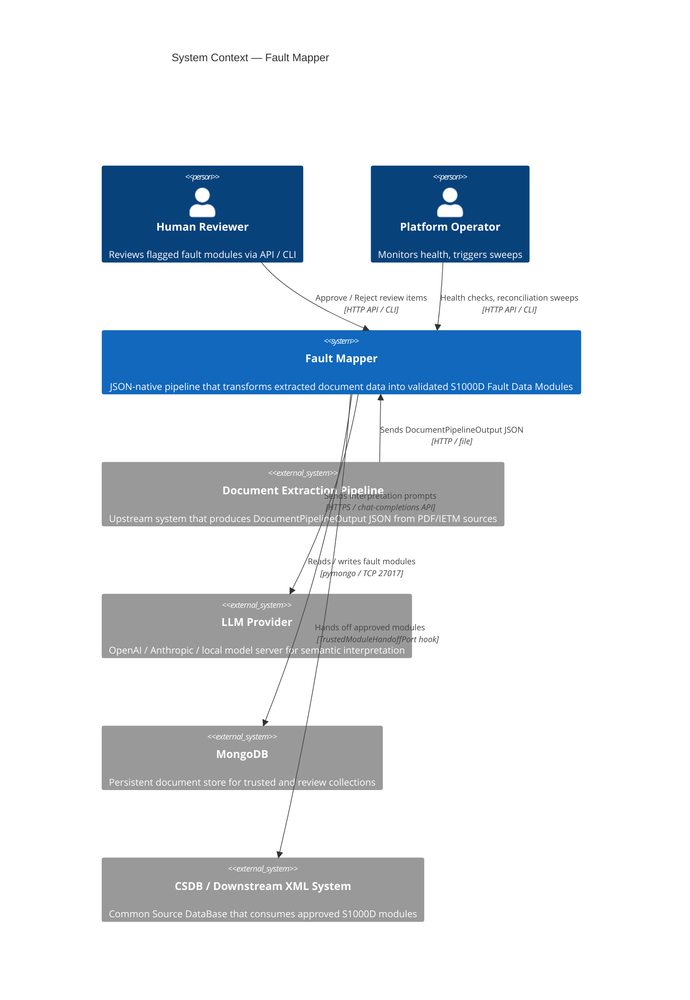
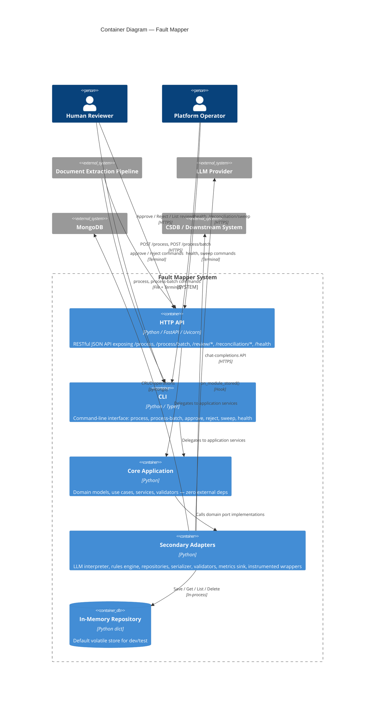
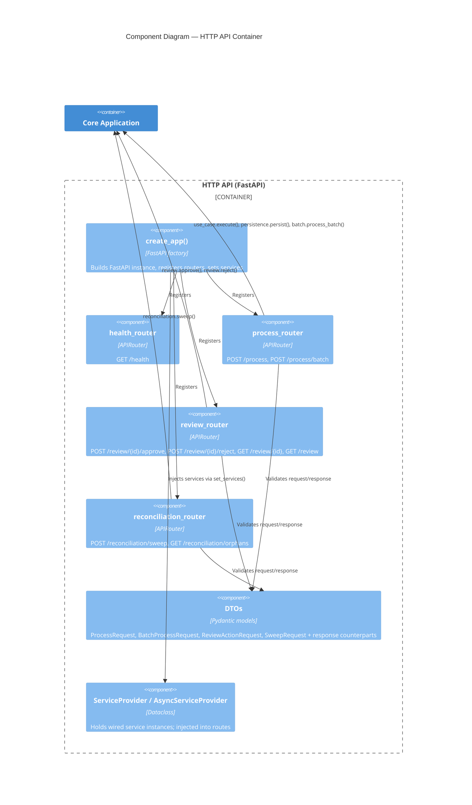
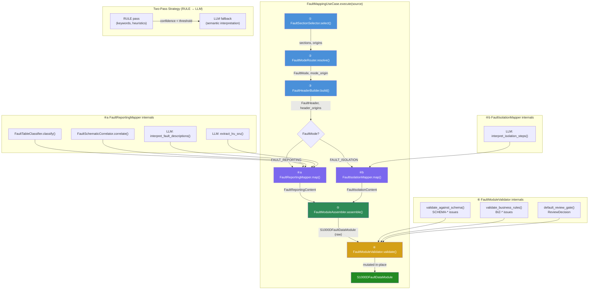
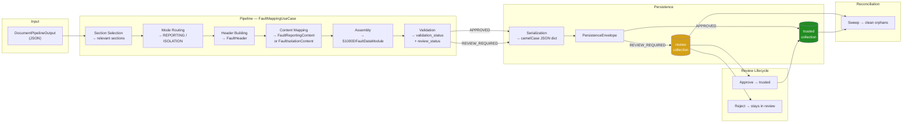
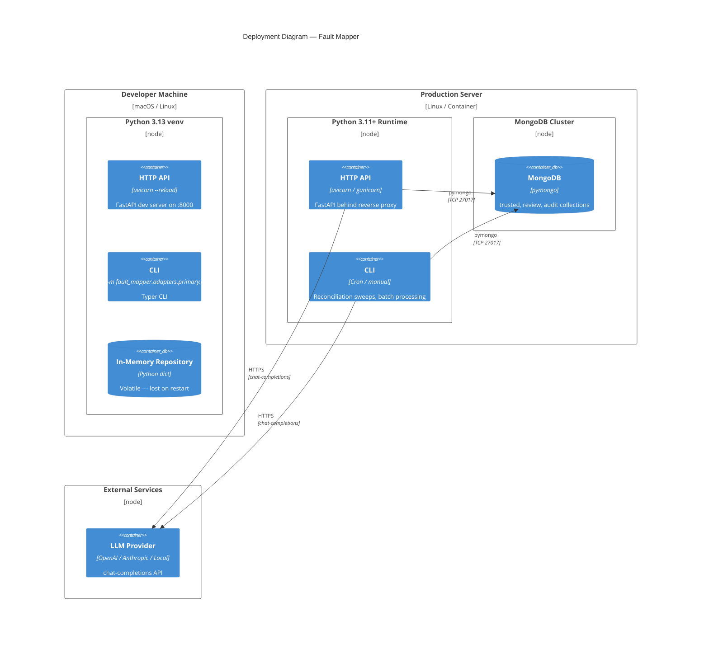

# Fault Mapper — C4 Architecture Diagrams

> **ARC42-compliant C4 model** for the `fault_mapper` JSON-native fault-module pipeline.
>
> Notation follows the [C4 model](https://c4model.com) by Simon Brown.
> Diagrams rendered with Mermaid for portability.

---

## Table of Contents

1. [Level 1 — System Context](#level-1--system-context)
2. [Level 2 — Container Diagram](#level-2--container-diagram)
3. [Level 3 — Component Diagram (API Container)](#level-3--component-diagram-api-container)
4. [Level 3 — Component Diagram (Core Application)](#level-3--component-diagram-core-application)
5. [Level 3 — Component Diagram (Secondary Adapters)](#level-3--component-diagram-secondary-adapters)
6. [Level 4 — Code Diagram (Mapping Pipeline)](#level-4--code-diagram-mapping-pipeline)
7. [Level 4 — Code Diagram (Lifecycle Services)](#level-4--code-diagram-lifecycle-services)
8. [Data Flow Diagram](#data-flow-diagram)
9. [Deployment View](#deployment-view)
10. [Quality Attributes / Cross-Cutting Concerns](#quality-attributes--cross-cutting-concerns)
11. [Decision Log](#decision-log)

---

## Level 1 — System Context

Shows the **Fault Mapper** system and the external actors / systems it
interacts with.

### Context Narrative

| Actor / System | Interaction | Direction |
|---|---|---|
| **Document Extraction Pipeline** | Provides `DocumentPipelineOutput` JSON (sections, tables, images, schematics) | Inbound |
| **LLM Provider** | Semantic interpretation — fault relevance, mode detection, descriptions, isolation steps, table classification, LRU/SRU extraction, schematic correlation | Outbound |
| **MongoDB** | Durable persistence for `trusted` (approved modules) and `review` (flagged modules) collections, plus `audit` events | Outbound |
| **CSDB / Downstream XML System** | Receives approved S1000D Fault Data Modules via the `TrustedModuleHandoffPort` hook | Outbound |
| **Human Reviewer** | Inspects `REVIEW_REQUIRED` modules, approves or rejects them via API or CLI | Bidirectional |
| **Platform Operator** | Monitors health, triggers reconciliation sweeps, views metrics | Bidirectional |

---

## Level 2 — Container Diagram

Zooms into **Fault Mapper** to show its deployable containers / processes.

### Container Responsibilities

| Container | Technology | Responsibility |
|---|---|---|
| **HTTP API** | FastAPI + Uvicorn | Thin async handlers: DTO validation → domain conversion → service call → response DTO. Supports both sync and async `ServiceProvider`. |
| **CLI** | Typer | Mirror of API commands for terminal use. Reads JSON files, invokes same services. |
| **Core Application** | Pure Python | All business logic. Domain models, value objects, enums, port protocols, use cases, lifecycle services. **Zero external dependencies.** |
| **Secondary Adapters** | Python + pymongo + jsonschema | Implements domain ports: LLM client, rules engine, repositories (in-memory / MongoDB), serializer, schema validator, structural/business-rule validators, review gate, metrics sink, instrumented decorators. |
| **In-Memory Repository** | Python `dict` | Default volatile store; satisfies `FaultModuleRepositoryPort` for dev, test, and single-process deployments. |

---

## Level 3 — Component Diagram (API Container)

### API Endpoint Summary

| Method | Path | DTO In | DTO Out | Service Called |
|---|---|---|---|---|
| `GET` | `/health` | — | `HealthResponse` | — |
| `POST` | `/process` | `ProcessRequest` | `ProcessResponse` | `use_case.execute()` → `persistence.persist()` |
| `POST` | `/process/batch` | `BatchProcessRequest` | `BatchProcessResponse` | `batch.process_batch()` |
| `POST` | `/review/{id}/approve` | `ReviewActionRequest?` | `ReviewActionResponse` | `review.approve()` |
| `POST` | `/review/{id}/reject` | `ReviewActionRequest?` | `ReviewActionResponse` | `review.reject()` |
| `GET` | `/review/{id}` | — | `ReviewItemResponse` | `review.get_review_item()` |
| `GET` | `/review` | `?limit=&offset=` | `ReviewListResponse` | `review.list_review_items()` |
| `POST` | `/reconciliation/sweep` | `SweepRequest?` | `SweepResponse` | `reconciliation.sweep()` |
| `GET` | `/reconciliation/orphans` | — | `OrphansResponse` | `reconciliation.find_orphaned_review_ids()` |

---

## Level 3 — Component Diagram (Core Application)

```mermaid
C4Component
    title Component Diagram — Core Application

    Container_Boundary(core, "Core Application") {

        Component(useCase, "FaultMappingUseCase", "Application Service", "6-step orchestrator: select → route → header → map → assemble → validate")
        Component(selector, "FaultSectionSelector", "Application Service", "Two-pass RULE→LLM section filtering")
        Component(router, "FaultModeRouter", "Application Service", "Two-pass RULE→LLM mode determination")
        Component(headerBuilder, "FaultHeaderBuilder", "Application Service", "Rules-only DM header construction")
        Component(reportingMapper, "FaultReportingMapper", "Application Service", "LLM-driven fault-reporting content extraction")
        Component(isolationMapper, "FaultIsolationMapper", "Application Service", "LLM-driven isolation decision-tree extraction")
        Component(tableClassifier, "FaultTableClassifier", "Application Service", "Two-pass RULE→LLM table classification")
        Component(schematicCorrelator, "FaultSchematicCorrelator", "Application Service", "Correlates schematics to fault entries")
        Component(assembler, "FaultModuleAssembler", "Application Service", "Deterministic final assembly — no LLM, no I/O")
        Component(validator, "FaultModuleValidator", "Application Service", "Schema + business-rule validation + review gating")

        Component(persistence, "FaultModulePersistenceService", "Lifecycle Service", "APPROVED→trusted, REVIEW_REQUIRED→review routing")
        Component(review, "FaultModuleReviewService", "Lifecycle Service", "Approve / Reject / query review queue")
        Component(recon, "FaultModuleReconciliationService", "Lifecycle Service", "Orphan detection + cleanup sweep")
        Component(batch, "FaultBatchProcessingService", "Lifecycle Service", "Sequential multi-doc orchestration with per-item isolation")

        Component(asyncPersistence, "AsyncFaultModulePersistenceService", "Async Lifecycle", "Async mirror of persistence")
        Component(asyncReview, "AsyncFaultModuleReviewService", "Async Lifecycle", "Async mirror of review")
        Component(asyncRecon, "AsyncFaultModuleReconciliationService", "Async Lifecycle", "Async mirror of reconciliation")
        Component(asyncBatch, "AsyncFaultBatchProcessingService", "Async Lifecycle", "Bounded-concurrency (semaphore) async batch")

        Component(models, "Domain Models", "Dataclasses", "S1000DFaultDataModule, DocumentPipelineOutput, and 40+ sub-models")
        Component(valueObjects, "Value Objects", "Frozen Dataclasses", "DmCode, MappingTrace, PersistenceEnvelope, BatchReport, etc.")
        Component(ports, "Domain Ports", "typing.Protocol", "10 port interfaces: LLM, Rules, Repository, Audit, Metrics, Handoff")
        Component(enums, "Enums", "str/Enum", "FaultMode, ValidationStatus, ReviewStatus, FaultEntryType, etc.")
    }

    Rel(useCase, selector, "Step 1: select()")
    Rel(useCase, router, "Step 2: resolve()")
    Rel(useCase, headerBuilder, "Step 3: build()")
    Rel(useCase, reportingMapper, "Step 4a: map() [REPORTING]")
    Rel(useCase, isolationMapper, "Step 4b: map() [ISOLATION]")
    Rel(useCase, assembler, "Step 5: assemble()")
    Rel(useCase, validator, "Step 6: validate()")
    Rel(reportingMapper, tableClassifier, "Classifies tables")
    Rel(reportingMapper, schematicCorrelator, "Correlates schematics")
    Rel(batch, useCase, "Wraps execute() per item")
    Rel(batch, persistence, "Wraps persist() per item")
    Rel(asyncBatch, useCase, "to_thread(execute()) per item")
    Rel(asyncBatch, asyncPersistence, "await persist() per item")
```

### Port Dependency Map

| Application Component | Ports Required |
|---|---|
| `FaultSectionSelector` | `RulesEnginePort`, `LlmInterpreterPort` |
| `FaultModeRouter` | `RulesEnginePort`, `LlmInterpreterPort` |
| `FaultHeaderBuilder` | `RulesEnginePort` |
| `FaultReportingMapper` | `LlmInterpreterPort`, `RulesEnginePort` |
| `FaultIsolationMapper` | `LlmInterpreterPort`, `RulesEnginePort` |
| `FaultTableClassifier` | `RulesEnginePort`, `LlmInterpreterPort` |
| `FaultSchematicCorrelator` | `LlmInterpreterPort`, `RulesEnginePort` |
| `FaultModuleAssembler` | `RulesEnginePort`, `MappingReviewPolicyPort?` |
| `FaultModulePersistenceService` | `FaultModuleRepositoryPort` |
| `FaultModuleReviewService` | `FaultModuleRepositoryPort`, `TrustedModuleHandoffPort?`, `AuditRepositoryPort?` |
| `FaultModuleReconciliationService` | `FaultModuleRepositoryPort`, `AuditRepositoryPort?` |
| All instrumented wrappers | `MetricsSinkPort` |

---

## Level 3 — Component Diagram (Secondary Adapters)

```mermaid
C4Component
    title Component Diagram — Secondary Adapters

    Container_Boundary(adapters, "Secondary Adapters") {

        Component(llmAdapter, "LlmInterpreterAdapter", "Adapter", "Implements LlmInterpreterPort — wraps OpenAI-compatible chat-completions client; all prompt engineering lives here")
        Component(rulesAdapter, "RulesAdapter", "Adapter", "Implements RulesEnginePort — 14 deterministic rule methods driven by MappingConfig")
        Component(inMemRepo, "InMemoryFaultModuleRepository", "Adapter", "Implements FaultModuleRepositoryPort — dict-backed (collection, record_id) store")
        Component(asyncInMemRepo, "AsyncInMemoryFaultModuleRepository", "Adapter", "Implements AsyncFaultModuleRepositoryPort — async wrapper over in-memory")
        Component(mongoRepo, "MongoDBFaultModuleRepository", "Adapter", "Implements FaultModuleRepositoryPort — pymongo-based; logical→physical collection mapping")
        Component(inMemAudit, "InMemoryAuditRepository", "Adapter", "Implements AuditRepositoryPort — list-backed audit store")
        Component(asyncInMemAudit, "AsyncInMemoryAuditRepository", "Adapter", "Implements AsyncAuditRepositoryPort")
        Component(metricsSink, "InMemoryMetricsSink", "Adapter", "Implements MetricsSinkPort — captures MetricRecord list for test inspection")
        Component(serializer, "serialize_module()", "Pure Function", "S1000DFaultDataModule → camelCase JSON dict matching schema")
        Component(schemaValidator, "validate_against_schema()", "Callable", "jsonschema Draft 2020-12 validation against fault_data_module.schema.json")
        Component(structValidator, "validate_structure()", "Callable", "Hand-coded STRUCT-001..017 checks")
        Component(bizValidator, "validate_business_rules()", "Callable", "BIZ-001..012 deterministic business checks")
        Component(reviewGate, "default_review_gate()", "Callable", "Errors→REJECTED, warnings→NOT_REVIEWED, clean→APPROVED")

        Component(instrUseCase, "InstrumentedFaultMappingUseCase", "Decorator", "Emits mapping.executed, mapping.duration_ms, mapping.failed")
        Component(instrPersist, "InstrumentedFaultModulePersistenceService", "Decorator", "Emits persistence.executed, persistence.duration_ms")
        Component(instrReview, "InstrumentedFaultModuleReviewService", "Decorator", "Emits review.approved, review.rejected, review.not_found")
        Component(instrRecon, "InstrumentedFaultModuleReconciliationService", "Decorator", "Emits reconciliation.executed, reconciliation.duration_ms")
        Component(instrBatch, "InstrumentedFaultBatchProcessingService", "Decorator", "Emits batch.executed, batch.duration_ms, batch.total/succeeded/failed")
    }

    Component(ports, "Domain Ports", "typing.Protocol", "10 port interfaces")
    System_Ext(llmProvider, "LLM Provider")
    System_Ext(mongoDB, "MongoDB")

    Rel(llmAdapter, llmProvider, "HTTPS / chat-completions")
    Rel(llmAdapter, ports, "Implements LlmInterpreterPort")
    Rel(rulesAdapter, ports, "Implements RulesEnginePort")
    Rel(inMemRepo, ports, "Implements FaultModuleRepositoryPort")
    Rel(mongoRepo, mongoDB, "pymongo CRUD")
    Rel(mongoRepo, ports, "Implements FaultModuleRepositoryPort")
    Rel(inMemAudit, ports, "Implements AuditRepositoryPort")
    Rel(metricsSink, ports, "Implements MetricsSinkPort")
```

### Port → Adapter Mapping

| Domain Port | Sync Adapter(s) | Async Adapter(s) |
|---|---|---|
| `LlmInterpreterPort` | `LlmInterpreterAdapter` | — (not yet needed) |
| `RulesEnginePort` | `RulesAdapter` | — (stateless, sync-only) |
| `MappingReviewPolicyPort` | `default_review_gate()` | — |
| `FaultModuleRepositoryPort` | `InMemoryFaultModuleRepository`, `MongoDBFaultModuleRepository` | — |
| `AsyncFaultModuleRepositoryPort` | — | `AsyncInMemoryFaultModuleRepository` |
| `AuditRepositoryPort` | `InMemoryAuditRepository` | — |
| `AsyncAuditRepositoryPort` | — | `AsyncInMemoryAuditRepository` |
| `MetricsSinkPort` | `InMemoryMetricsSink` | — (same; sync protocol) |
| `TrustedModuleHandoffPort` | (caller-provided / optional) | — |

---

## Level 4 — Code Diagram (Mapping Pipeline)

The 6-step pipeline inside `FaultMappingUseCase.execute()`:

### Mapping Strategy Legend

| Strategy | Where Applied | Description |
|---|---|---|
| `DIRECT` | Header fields, DM-code segments | Value copied verbatim from source |
| `RULE` | Section selection, mode routing, table classification, header construction | Deterministic keyword / heuristic match |
| `LLM` | Fault descriptions, isolation steps, LRU/SRU extraction, schematic correlation | Semantic interpretation via LLM with structured output |

Each field's strategy is tracked in `MappingTrace.field_origins` (a `dict[str, FieldOrigin]`) for full provenance.

---

## Level 4 — Code Diagram (Lifecycle Services)

```mermaid
flowchart TD
    subgraph "Persistence Flow"
        P1["persist(module)"]
        P2{validation_status?}
        P3["serialize → PersistenceEnvelope<br/>collection='trusted'"]
        P4["serialize → PersistenceEnvelope<br/>collection='review'"]
        P5["PersistenceResult(success=False)<br/>'Ineligible for persistence'"]
        P6["repo.save(envelope)"]
        P7["PersistenceResult"]

        P1 --> P2
        P2 -->|APPROVED| P3
        P2 -->|REVIEW_REQUIRED| P4
        P2 -->|SCHEMA_FAILED / REJECTED / etc.| P5
        P3 --> P6
        P4 --> P6
        P6 --> P7
    end

    subgraph "Review Flow"
        R1["approve(record_id)"]
        R2["Fetch from 'review'"]
        R3["Update status → APPROVED"]
        R4["Save to 'trusted'"]
        R5["Delete from 'review'"]
        R6["TrustedModuleHandoffPort.on_module_stored()"]
        R7["AuditEntry(REVIEW_APPROVED)"]

        R1 --> R2 --> R3 --> R4 --> R5
        R5 --> R6
        R5 --> R7

        RJ1["reject(record_id)"]
        RJ2["Fetch from 'review'"]
        RJ3["Update status → REJECTED"]
        RJ4["Save back to 'review'"]
        RJ5["AuditEntry(REVIEW_REJECTED)"]

        RJ1 --> RJ2 --> RJ3 --> RJ4
        RJ4 --> RJ5
    end

    subgraph "Reconciliation Flow"
        S1["sweep(dry_run, limit)"]
        S2["List review record_ids"]
        S3["List trusted record_ids"]
        S4["Intersect → orphans"]
        S5{dry_run?}
        S6["Delete orphan from 'review'"]
        S7["ReconciliationReport"]

        S1 --> S2
        S1 --> S3
        S2 --> S4
        S3 --> S4
        S4 --> S5
        S5 -->|No| S6
        S5 -->|Yes| S7
        S6 --> S7
    end

    subgraph "Batch Flow"
        B1["process_batch(items)"]
        B2["for each item"]
        B3["use_case.execute(source)"]
        B4["persistence.persist(module)"]
        B5["BatchItemResult"]
        B6["BatchReport"]

        B1 --> B2
        B2 --> B3
        B3 -->|success| B4
        B3 -->|error| B5
        B4 --> B5
        B2 -->|"all items done"| B6
    end

    style P3 fill:#228b22,color:#fff
    style P4 fill:#d4a017,color:#fff
    style P5 fill:#cd5c5c,color:#fff
    style R4 fill:#228b22,color:#fff
    style RJ4 fill:#cd5c5c,color:#fff
    style S6 fill:#ff8c00,color:#fff
```

---

## Data Flow Diagram

End-to-end data transformation from source document to stored module:

---

## Deployment View

### Deployment Configurations

| Environment | Repository | LLM | Metrics |
|---|---|---|---|
| **Unit tests** | `FakeFaultModuleRepository` / `AsyncFakeFaultModuleRepository` | `_StubUseCase` (no LLM) | `InMemoryMetricsSink` |
| **Development** | `InMemoryFaultModuleRepository` | Real or mocked LLM client | `InMemoryMetricsSink` |
| **Integration tests** | `MongoDBFaultModuleRepository` (Testcontainers) | Mocked | `InMemoryMetricsSink` |
| **Production** | `MongoDBFaultModuleRepository` | Real LLM provider | Production metrics sink |

---

## Quality Attributes / Cross-Cutting Concerns

### Observability

All services have optional **instrumented decorator wrappers** that emit metrics via `MetricsSinkPort`:

| Wrapper | Metrics Emitted |
|---|---|
| `InstrumentedFaultMappingUseCase` | `mapping.executed`, `mapping.duration_ms`, `mapping.failed` |
| `InstrumentedFaultModulePersistenceService` | `persistence.executed`, `persistence.duration_ms`, `persistence.failed` |
| `InstrumentedFaultModuleReviewService` | `review.approved`, `review.rejected`, `review.not_found`, `review.duration_ms` |
| `InstrumentedFaultModuleReconciliationService` | `reconciliation.executed`, `reconciliation.duration_ms`, `reconciliation.duplicates_found`, `reconciliation.duplicates_cleaned` |
| `InstrumentedFaultBatchProcessingService` | `batch.executed`, `batch.duration_ms`, `batch.total`, `batch.succeeded`, `batch.failed` |
| + Async versions of all above | Same metric names |

### Auditability

- `AuditRepositoryPort` / `AsyncAuditRepositoryPort` captures `AuditEntry` events:
  - `REVIEW_APPROVED` — who approved, when, with reason
  - `REVIEW_REJECTED` — who rejected, when, with reason
  - `RECONCILIATION_CLEANED` / `RECONCILIATION_SKIPPED` — sweep outcomes

### Testability

| Strategy | Implementation |
|---|---|
| Hexagonal ports | All external dependencies behind `typing.Protocol` interfaces |
| Test doubles | `FakeFaultModuleRepository`, `AsyncFakeFaultModuleRepository`, `FakeAuditRepository`, `AsyncFakeAuditRepository` |
| In-memory defaults | `InMemoryFaultModuleRepository`, `InMemoryAuditRepository`, `InMemoryMetricsSink` |
| Factory isolation | `FaultMapperFactory` accepts all dependencies via constructor injection |
| Coverage | **563 passed, 65 skipped** across unit, integration, API, and CLI tests |

### Error Isolation (Batch)

- **Partial success model** — one item failing does not prevent others
- Per-item `try/except` wraps both mapping and persistence
- `BatchItemResult` captures error details alongside any partial module metadata
- `BatchReport` provides aggregate counters for monitoring

---

## Decision Log

| # | Decision | Rationale |
|---|---|---|
| **ADR-01** | Hexagonal / Ports-and-Adapters architecture | Decouples domain logic from I/O; enables swapping LLM providers, databases, and metrics backends without touching business code |
| **ADR-02** | Domain layer has zero external dependencies | Ensures testability and portability; all external concerns are adapter-level |
| **ADR-03** | Two-pass RULE → LLM strategy | Deterministic rules are cheaper and more predictable; LLM is fallback for ambiguous cases. Confidence thresholds are configurable. |
| **ADR-04** | `FaultMappingUseCase` is always sync | CPU-bound LLM prompt construction + response parsing; no I/O in the use case itself (LLM calls are within adapters). In async contexts, wrapped with `asyncio.to_thread()`. |
| **ADR-05** | Dual sync/async service mirrors | Supports both synchronous CLI and asynchronous API deployments without forcing either model |
| **ADR-06** | `MappingTrace` with `FieldOrigin` per field | Full provenance — every output field records its strategy (DIRECT/RULE/LLM), source path, and confidence score |
| **ADR-07** | JSON-native persistence (no XML/XSD) | Modules stored as serialised JSON dicts; XML generation is a downstream concern outside this system |
| **ADR-08** | Staged trust: `review` → `trusted` collections | Approved modules go directly to trusted; review-required modules are held for human decision. Reconciliation sweep cleans orphans. |
| **ADR-09** | Batch as orchestration-only (no logic duplication) | `FaultBatchProcessingService` wraps existing single-item use case + persistence; no mapping/validation code is duplicated |
| **ADR-10** | Bounded concurrency for async batch | `asyncio.Semaphore(max_concurrency)` prevents overwhelming downstream persistence backends while maintaining throughput |
| **ADR-11** | Optional dependencies via `None` defaults | LLM client, audit repo, metrics sink, handoff hook are all optional. Factory and providers handle `None` gracefully. |
| **ADR-12** | Instrumented wrappers as decorators | Metrics concern is separated from business logic; wrappers are applied at factory level when a `MetricsSinkPort` is provided |

---

> **Generated**: 14 April 2026 | **Source**: fault_mapper codebase survey | **Notation**: C4 + Mermaid
